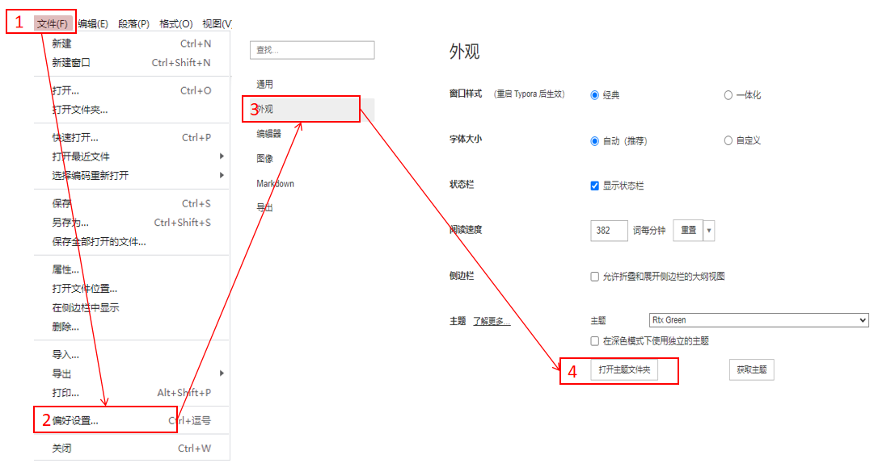

# 帮助文档

## 1.声明

**本项目由typora主题：orangeheart更改，仅供自用,不可作为任何商业用途，原作者项目地址[orangeheart](https://theme.typoraio.cn/theme/OrangeHeart/),**

## 2.关于标题

# 一级标题样式

## 3.二级标题样式

### 三级标题样式

#### 四级标题样式

##### 五级标题样式

###### 六级标题样式


## 4.关于链接

[w3school 在线教程](https://www.w3school.com.cn/index.html)

## 5.关于表格

| name |  sex   | age  |
| :--: | :----: | :--: |
| rtx  |  male  |  18  |
| aaa  | female |  20  |
| xxx  |  male  |  30  |
| ccc  |  male  |  40  |


##  6.关于代码

```python
import pandas as pd
import numpy as np
a = pd.read_pd.read_csv('12sd32.csv')
# 这是一行注释
```

```json
{"name":"rtx",
 "sex":"male"} 
```

##  7.关于其他

1. 水平分割线

------

2. 引用

   > 本产品基础样式应用orangeheart，仅供自用或分享，不可作为商业用途使用。原作者项目地址  [orangeheart theme](https://theme.typoraio.cn/theme/OrangeHeart/)

3. 行内代码

   `123213123123`行内代码的格式：``

4. 项目列表

   - [x]  

   - [x] 

5. 关于latex


$$
\left[
 \begin{matrix}
   1 & 2 & 3 \\\
   \int_{0}^{\frac{\pi}{2}}\frac{\sin(x)}{x} & \lim_{x\rightarrow0} \sin(x+y) & \sqrt [3]{x_1^2 + x_2^2 + x_3^2 + x_4^2} \\\
   \frac{x}{y} & \sum_{i=1}^{n}f_n & 1 + \left(\frac{1}{1-x^2}\right)^3 
  \end{matrix}
  \right]
$$

## 8.关于安装

​         打开typora之后，按照“文件-偏好设置-外观-打开主题文件夹”顺序点击，打开typora主题文件夹，把rtx-green.css拷贝到该目录即可，其余项目可选择性拷贝，不影响使用。




